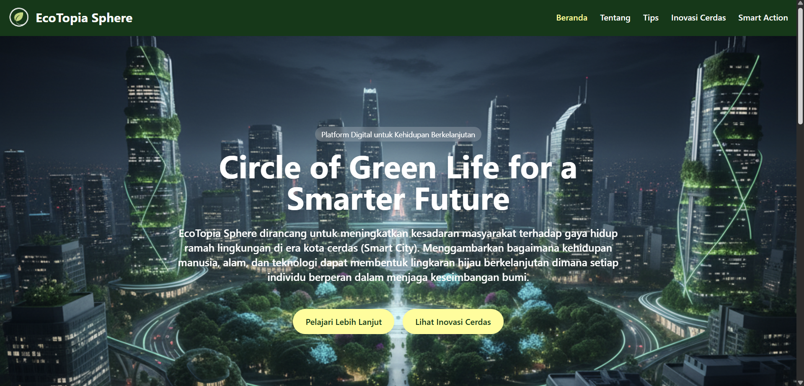
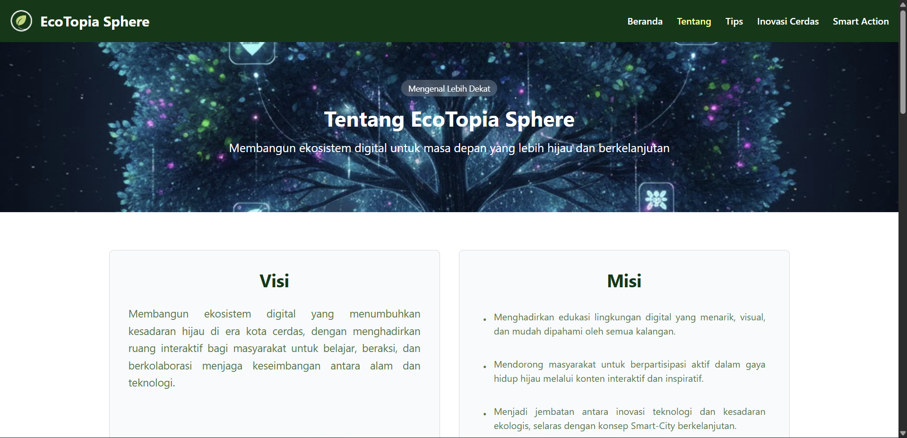
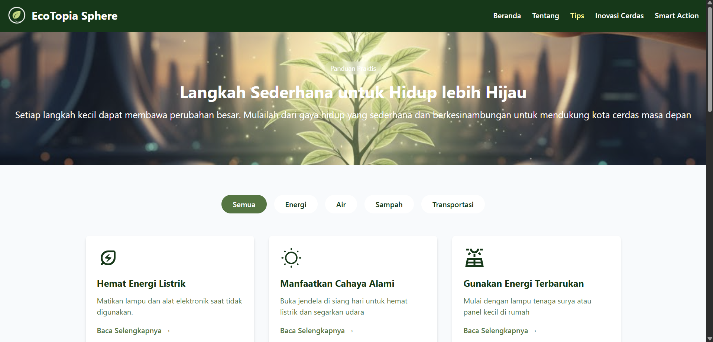
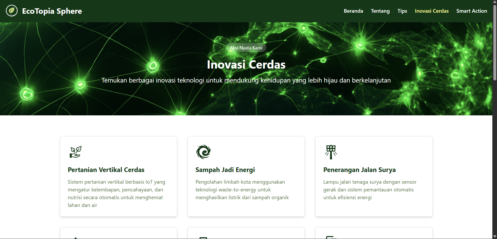
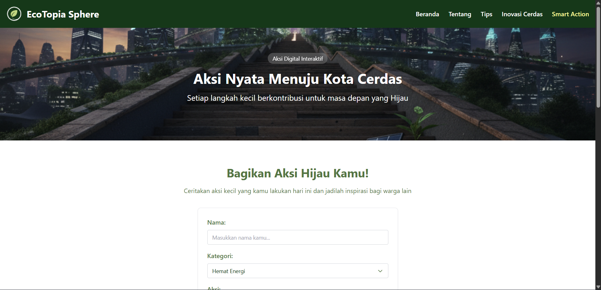
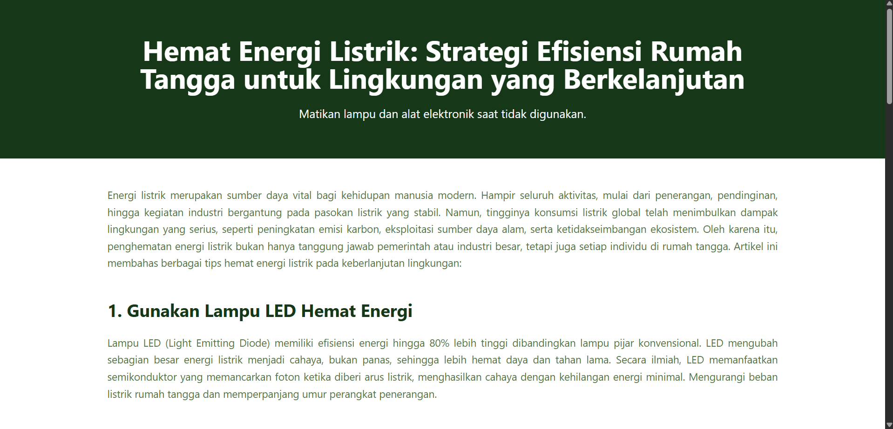

# 🌿 EcoTopia Sphere

<div align="center">


**Platform digital untuk kehidupan berkelanjutan — Circle of Green Life for a Smarter Future**

</div>

---

## 📋 Deskripsi Proyek

**EcoTopia Sphere** adalah platform web interaktif yang dirancang untuk meningkatkan kesadaran masyarakat terhadap gaya hidup ramah lingkungan di era kota cerdas (Smart City). Platform ini menggambarkan bagaimana kehidupan manusia, alam, dan teknologi dapat membentuk lingkaran hijau berkelanjutan — di mana setiap individu berperan dalam menjaga keseimbangan bumi.

Dibangun dengan Vue 3, Vite, dan Tailwind CSS, EcoTopia Sphere menyediakan:

- Edukasi lingkungan melalui artikel tips gaya hidup hijau yang terstruktur
- Showcase inovasi teknologi ramah lingkungan untuk kota cerdas
- Fitur Smart Action untuk berbagi dan menginspirasi aksi hijau antar pengguna
- Informasi visi, misi, dan filosofi platform secara transparan

---

## 📑 Daftar Isi

- [Deskripsi Proyek](#-deskripsi-proyek)
- [Demo](#-demo)
- [Tampilan Aplikasi](#-tampilan-aplikasi)
- [Latar Belakang](#-latar-belakang)
- [Fitur Utama](#-fitur-utama)
- [Teknologi yang Digunakan](#-teknologi-yang-digunakan)
- [Arsitektur](#-arsitektur)
- [Struktur Proyek](#-struktur-proyek)
- [Cara Instalasi](#-cara-instalasi)
- [Cara Penggunaan](#-cara-penggunaan)
- [Peran Developer](#-peran-developer)
- [Pembelajaran dari Proyek](#-pembelajaran-dari-proyek-lessons-learned)
- [Ucapan Terima Kasih](#-ucapan-terima-kasih)

---

## 🎮 Demo

(Coming Soon)

---

## 📸 Tampilan Aplikasi

### Halaman Beranda



### Halaman Tentang




### Halaman Tips




### Halaman Inovasi Cerdas



### Halaman Smart Action




### Halaman Artikel




---

## 🎯 Latar Belakang

Proyek ini lahir dari keprihatinan terhadap rendahnya kesadaran masyarakat akan pentingnya gaya hidup berkelanjutan di tengah pesatnya perkembangan kota cerdas. Beberapa kebutuhan yang melatarbelakangi pembuatan EcoTopia Sphere:

- **Kurangnya platform edukasi lingkungan yang menarik** — Informasi tentang gaya hidup hijau seringkali tersebar dan tidak terstruktur, sehingga dibutuhkan satu platform terpadu yang mudah diakses
- **Mendorong partisipasi aktif masyarakat** — Tidak cukup hanya membaca, masyarakat perlu difasilitasi untuk berbagi dan menginspirasi satu sama lain melalui aksi nyata
- **Menjembatani teknologi dan ekologi** — Inovasi Smart City perlu dikomunikasikan secara visual dan mudah dipahami agar masyarakat umum dapat ikut berpartisipasi
- **Membangun ekosistem digital hijau** — Dibutuhkan ruang interaktif yang menghubungkan edukasi, aksi, dan inovasi dalam satu ekosistem yang kohesif

---

## 🌟 Fitur Utama

### 🏠 Beranda
| Fitur | Deskripsi |
|-------|-----------|
| Hero Section | Tampilan utama dengan tagline dan navigasi ke halaman utama |
| Tiga Pilar | Visualisasi tiga pilar platform: Edukasi, Aksi, dan Inovasi |
| Dampak Nyata | Statistik animasi yang menampilkan dampak nyata dari aksi hijau kolektif |
| CTA Section | Ajakan untuk mulai perjalanan hijau bersama |

### 📚 Tips Gaya Hidup Hijau
| Fitur | Deskripsi |
|-------|-----------|
| Filter Kategori | Filter tips berdasarkan kategori: Energi, Air, Sampah, Transportasi |
| 12 Artikel Tips | Konten edukatif lengkap untuk setiap tips gaya hidup hijau |
| Halaman Artikel | Setiap tips memiliki halaman artikel tersendiri dengan konten mendalam |
| Navigasi Artikel | Navbar dan footer disembunyikan di halaman artikel untuk fokus membaca |

### 💡 Inovasi Cerdas
| Fitur | Deskripsi |
|-------|-----------|
| 10 Kartu Inovasi | Showcase inovasi teknologi hijau untuk kota cerdas |
| Deskripsi Detail | Penjelasan teknis setiap inovasi secara ringkas dan informatif |
| CTA Inovasi | Ajakan untuk mulai berkontribusi pada inovasi hijau |

### 🤝 Smart Action
| Fitur | Deskripsi |
|-------|-----------|
| Form Berbagi Aksi | Form interaktif untuk berbagi aksi hijau yang telah dilakukan |
| Kategori Aksi | Pilihan kategori: Hemat Energi, Hemat Air, Kelola Sampah, Transportasi Ramah, Lainnya |
| Daftar Aksi Komunitas | Tampilan aksi-aksi yang telah dibagikan oleh pengguna lain |
| Persistensi Data | Data aksi tersimpan di localStorage agar tidak hilang saat refresh |
| Popup Konfirmasi | Notifikasi sukses setelah aksi berhasil dikirim |
| Developer Reset | Fitur tersembunyi (tekan 'D' 3x) untuk menghapus semua data aksi |

### ℹ️ Tentang
| Fitur | Deskripsi |
|-------|-----------|
| Visi & Misi | Penjelasan visi dan misi platform secara transparan |
| Makna Nama | Penjelasan filosofi di balik nama "EcoTopia Sphere" |
| Filosofi Logo | Penjelasan makna setiap elemen visual pada logo platform |

---

## 🛠️ Teknologi yang Digunakan

### Core Technologies
| Teknologi | Fungsi | Versi |
|-----------|--------|-------|
| **Vue.js 3** | Framework utama dengan Composition API | ^3.4.0 |
| **Vue Router 4** | Navigasi SPA dengan mode history | ^4.3.0 |
| **Vite** | Build tool dan dev server | ^5.1.0 |
| **Tailwind CSS** | Utility-first CSS framework | ^3.4.0 |

### Dev Dependencies
| Library | Fungsi |
|---------|--------|
| **@vitejs/plugin-vue** | Plugin Vite untuk kompilasi Vue SFC |
| **PostCSS** | Transformasi CSS untuk Tailwind |
| **Autoprefixer** | Vendor prefix otomatis untuk CSS |

### Web API
| API | Fungsi |
|-----|--------|
| **localStorage** | Persistensi data aksi pengguna di browser |
| **Vue Router History Mode** | URL bersih tanpa hash fragment |

---

## 🏗️ Arsitektur

### Pola Desain yang Digunakan

- **Component-based Architecture** — Setiap section halaman dikemas dalam komponen Vue yang terpisah dan reusable
- **Single File Components (SFC)** — Template, script, dan style dalam satu file `.vue`
- **Composition API** — Menggunakan `ref`, `computed`, `onMounted` untuk logika reaktif yang terstruktur
- **Props & Emits** — Komunikasi antar komponen menggunakan props ke bawah dan emits ke atas
- **Lazy Loading Routes** — Halaman artikel di-load secara dinamis untuk performa optimal

---

## 📁 Struktur Proyek

```
ecotopiasphere/
│
├── index.html                    # Entry point HTML
├── package.json                  # Konfigurasi proyek dan dependensi
├── vite.config.js                # Konfigurasi Vite
├── tailwind.config.js            # Konfigurasi Tailwind CSS dan custom colors
├── postcss.config.js             # Konfigurasi PostCSS
│
├── public/
│   └── favicon.ico               # Favicon aplikasi
│
└── src/
    ├── main.js                   # Entry point Vue — inisialisasi app dan router
    ├── App.vue                   # Root component — layout global dengan Navbar & Footer
    ├── style.css                 # Global styles
    │
    ├── router/
    │   └── index.js              # Definisi semua route (5 halaman utama + 12 artikel)
    │
    ├── pages/                    # Halaman-halaman utama
    │   ├── Beranda.vue
    │   ├── Tips.vue
    │   ├── InovasiCerdas.vue
    │   ├── SmartAction.vue
    │   ├── Tentang.vue
    │   └── artikel/              # 12 halaman artikel tips (lazy loaded)
    │       ├── HematEnergiListrik.vue
    │       ├── ManfaatCahayaAlami.vue
    │       └── ... (10 artikel lainnya)
    │
    ├── components/               # Komponen reusable per halaman
    │   ├── Navbar.vue
    │   ├── Footer.vue
    │   ├── beranda/              # HeroSection, EdukasiAksiInovasi, DampakNyata, CTA
    │   ├── tips/                 # HeroSection, TipsGrid, CTA
    │   ├── inovasi-cerdas/       # HeroSection, Cards, CTA
    │   ├── smart-action/         # HeroSection, ActionForm, ShareAction, SharedActions, CTA
    │   └── tentang/              # HeroSection, VisiMisi, MaknaNama, FilosofiLogo, CTA
    │
    └── assets/                   # Gambar dan ikon SVG
        ├── beranda.jpg
        ├── tips.jpg
        ├── inovasi-cerdas.jpg
        ├── smart-action.jpg
        ├── tentang.jpg
        └── icons/                # SVG icons per halaman (beranda, tips, inovasi-cerdas, dll.)
```

### Penjelasan File & Folder Utama

| Path | Fungsi |
|------|--------|
| `src/main.js` | Inisialisasi Vue app, registrasi router, dan mounting ke DOM |
| `src/App.vue` | Root component yang mengatur visibilitas Navbar dan Footer berdasarkan route |
| `src/router/index.js` | Konfigurasi semua route dengan lazy loading untuk halaman artikel |
| `tailwind.config.js` | Custom color palette (primary, secondary, accent, background, dll.) |
| `src/components/smart-action/ActionForm.vue` | Form interaktif dengan validasi, dropdown kategori, dan popup sukses |
| `src/components/beranda/DampakNyataSection.vue` | Statistik dengan animasi counter menggunakan `setInterval` |

---

## 📥 Cara Instalasi

### Prasyarat

- **Node.js 18+** — Runtime JavaScript
- **npm** atau **yarn** — Package manager

### Langkah-langkah

**1. Clone Repository**

```bash
git clone https://github.com/Chrisimana/ecotopia-sphere.git
cd ecotopia-sphere
```

**2. Install Dependensi**

```bash
npm install
```

**3. Jalankan Development Server**

```bash
npm run dev
```

Aplikasi akan berjalan di `http://localhost:5173`

**4. Build untuk Produksi**

```bash
npm run build
```

**5. Preview Build Produksi**

```bash
npm run preview
```

---

## 🎮 Cara Penggunaan

### Navigasi Halaman

Gunakan Navbar di bagian atas untuk berpindah antar halaman:
- **Beranda** — Halaman utama dengan overview platform
- **Tips** — Kumpulan tips gaya hidup hijau
- **Inovasi Cerdas** — Showcase inovasi teknologi hijau
- **Smart Action** — Berbagi aksi hijau
- **Tentang** — Informasi platform

### Membaca Tips

1. Buka halaman **Tips**
2. Gunakan tombol filter kategori (Semua / Energi / Air / Sampah / Transportasi) untuk menyaring tips
3. Klik **Baca Selengkapnya →** pada kartu tips untuk membuka artikel lengkap
4. Gunakan tombol kembali browser untuk kembali ke halaman Tips

### Berbagi Aksi Hijau

1. Buka halaman **Smart Action**
2. Isi form dengan nama, pilih kategori aksi, dan ceritakan aksi hijau yang telah dilakukan
3. Klik **Kirim Aksi Saya**
4. Aksi akan muncul di bagian daftar aksi komunitas di bawah form
5. Data tersimpan otomatis — tidak hilang saat halaman di-refresh

---

## 👨‍💻 Peran Developer

Saya mengembangkan seluruh proyek EcoTopia Sphere secara mandiri, mulai dari perencanaan arsitektur hingga implementasi fitur.

### Kontribusi per Area

| Area | Kontribusi |
|------|------------|
| **Perencanaan** | Merancang arsitektur komponen, struktur folder, dan alur data aplikasi |
| **UI/UX Design** | Mendesain layout, color palette, dan pengalaman pengguna yang konsisten |
| **Vue Components** | Membangun seluruh komponen SFC dengan Composition API |
| **Routing** | Konfigurasi Vue Router dengan lazy loading dan scroll behavior |
| **State Management** | Pengelolaan state reaktif dengan `ref` dan `computed` |
| **Data Persistence** | Implementasi localStorage untuk menyimpan data Smart Action |
| **Animasi** | Animasi counter pada statistik Dampak Nyata menggunakan `setInterval` |
| **Responsive Design** | Layout responsif menggunakan Tailwind CSS grid dan flexbox |
| **Konten** | Penulisan seluruh konten artikel, deskripsi inovasi, dan teks platform |

### Fokus Pengembangan

1. **Component-based Architecture** — Setiap section halaman dikemas dalam komponen terpisah untuk maintainability
2. **Composition API** — Menggunakan Vue 3 Composition API untuk logika yang lebih terstruktur dan reusable
3. **Tailwind CSS** — Utility-first approach untuk styling yang konsisten dan cepat
4. **Lazy Loading** — Halaman artikel di-load secara dinamis untuk performa optimal
5. **User Experience** — Animasi hover, transisi halus, dan feedback visual pada setiap interaksi

---

## 📚 Pembelajaran dari Proyek (Lessons Learned)

### Keterampilan Teknis yang Diperoleh

#### 1. Vue 3 Composition API

```javascript
// Penggunaan ref, computed, dan onMounted secara bersamaan
import { ref, computed, onMounted } from 'vue'

const activeCategory = ref('Semua')

const filteredTips = computed(() => {
  if (activeCategory.value === 'Semua') return tips.value
  return tips.value.filter(tip => tip.category === activeCategory.value)
})

onMounted(() => {
  const savedActions = localStorage.getItem('smartActions')
  if (savedActions) actions.value = JSON.parse(savedActions)
})
```

#### 2. Vue Router dengan Lazy Loading

```javascript
// Lazy loading untuk halaman artikel agar bundle awal lebih kecil
{
  path: '/artikel/hemat-energi-listrik',
  component: () => import('../pages/artikel/HematEnergiListrik.vue')
}
```

#### 3. Props & Emits untuk Komunikasi Komponen

```javascript
// ActionForm mengirim data ke parent melalui emit
const emit = defineEmits(['submit'])
emit('submit', { ...form })

// SmartAction.vue menerima dan memproses data
const handleSubmit = (data) => {
  const newAction = { ...data, id: Date.now(), timestamp: new Date().toISOString() }
  actions.value.unshift(newAction)
  localStorage.setItem('smartActions', JSON.stringify(actions.value))
}
```

#### 4. Animasi dengan JavaScript

```javascript
// Animasi counter untuk statistik Dampak Nyata
finalValues.forEach((finalValue, index) => {
  let current = 0
  const interval = setInterval(() => {
    if (current >= finalValue) {
      clearInterval(interval)
    } else {
      current++
      animatedValues.value[index] = current
    }
  }, 60)
})
```

#### 5. Tailwind CSS Custom Configuration

```javascript
// Mendefinisikan color palette kustom di tailwind.config.js
theme: {
  extend: {
    colors: {
      accent: '#FFFD8F',
      secondary: '#B0CE88',
      primary: '#4C763B',
      background: '#043915',
    }
  }
}
```

---

## 🙏 Ucapan Terima Kasih

### Sumber Daya dan Referensi

#### Dokumentasi Resmi
- [Vue.js Documentation](https://vuejs.org/) — Referensi utama Vue 3 dan Composition API
- [Vue Router Documentation](https://router.vuejs.org/) — Konfigurasi routing dan lazy loading
- [Tailwind CSS Documentation](https://tailwindcss.com/) — Utility classes dan konfigurasi tema
- [Vite Documentation](https://vitejs.dev/) — Build tool dan konfigurasi proyek
- [MDN Web Docs](https://developer.mozilla.org/) — Referensi Web Storage API dan JavaScript

#### Tools yang Membantu
- **Visual Studio Code** — Editor kode utama
- **Vite Dev Server** — Hot Module Replacement untuk pengembangan yang cepat
- **Shields.io** — Badge untuk README
- **GitHub** — Version control dan hosting repository

---

<div align="center">

**⭐ Jika proyek ini bermanfaat, jangan lupa beri bintang! ⭐**

*"Setiap langkah kecil menuju gaya hidup hijau adalah kontribusi nyata untuk masa depan yang lebih baik."*

</div>
